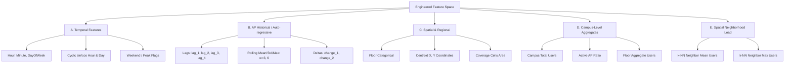

# Feature Engineering Design Document

**Project**: Predictive Bandwidth & WiFi Congestion Manager  
**Phase**: Phase 2 — Step 1: Feature Engineering Design  
**Status**: Completed & Approved  
**Author**: Machine Learning Engineering Team  

---

## 1. Executive Summary & Context

This document defines the mathematical formulation, rationale, leakage prevention safeguards, and architectural recommendations for the machine learning feature set used to forecast WiFi Access Point (AP) user loads and anticipate network congestion.

### Target Formulation
- **Primary Target ($y_{t+1}$)**: The integer number of connected users at Access Point $i$ at the next native temporal observation snapshot ($t+1$), corresponding to a median forecasting horizon of **$\approx 16.62$ minutes** ($\mu = 17.40$ minutes).
- **Secondary Target ($y_{t+2}$)**: The integer number of connected users at Access Point $i$ two native observation snapshots ahead ($t+2$), corresponding to a median forecasting horizon of **$\approx 33.27$ minutes** ($\mu = 34.80$ minutes).

### Dataset Invariants
- **247 Access Points** across **3 floors** (Floor 0: 73 APs, Floor 1: 85 APs, Floor 2: 89 APs).
- **5,131 synchronized multi-AP temporal snapshots** ($1,267,357$ total records).
- **Zero temporal resampling**: Native irregular intervals are preserved to maintain exact ground-truth integer user counts without synthetic interpolation distortion.

---

## 2. Feature Taxonomy

The feature store is organized into five distinct orthogonal categories:



---

## 3. Comprehensive Feature Catalog

| Feature Name | Category | Mathematical Definition | Operational Rationale | Correlation ($r$ with $y_{t+1}$) | Leakage Risk | Recommended |
| :--- | :--- | :--- | :--- | :---: | :---: | :---: |
| `users` | Current State | $u_{i,t}$ | Most recent observed user count at AP $i$ at time $t$. Baseline state. | **+0.9139** | None (Available at $t$) | **YES (Core)** |
| `users_lag_1` | AP Historical | $u_{i,t-1}$ | User count at previous snapshot ($t-1$, $\approx 17$m prior). Captures immediate momentum. | **+0.8274** | None (Past) | **YES (Core)** |
| `users_lag_2` | AP Historical | $u_{i,t-2}$ | User count 2 snapshots prior ($t-2$, $\approx 34$m prior). Multi-step trend baseline. | **+0.7454** | None (Past) | **YES (Core)** |
| `users_lag_3` | AP Historical | $u_{i,t-3}$ | User count 3 snapshots prior ($t-3$, $\approx 51$m prior). | **+0.6710** | None (Past) | **YES (Core)** |
| `users_lag_4` | AP Historical | $u_{i,t-4}$ | User count 4 snapshots prior ($t-4$, $\approx 68$m / 1 hr prior). | **+0.6025** | None (Past) | **YES (Optional)** |
| `rolling_mean_3` | AP Historical | $\frac{1}{3} \sum_{k=0}^{2} u_{i,t-k}$ | Short-term smoothed load over past ~50 minutes. Filters random noise. | **+0.8626** | None (Causal window $[t-2, t]$) | **YES (Core)** |
| `rolling_mean_6` | AP Historical | $\frac{1}{6} \sum_{k=0}^{5} u_{i,t-k}$ | Medium-term smoothed load over past ~100 minutes (lecture duration). | **+0.7840** | None (Causal window $[t-5, t]$) | **YES (Core)** |
| `rolling_mean_12` | AP Historical | $\frac{1}{12} \sum_{k=0}^{11} u_{i,t-k}$ | Long-term smoothed load over past ~3.5 hours. Captures half-day level. | **+0.6744** | None (Causal window $[t-11, t]$) | NO (High redundancy with mean_6) |
| `rolling_std_3` | AP Historical | $\sigma(u_{i, [t-2:t]})$ | Short-term local volatility / user churn rate. | **+0.5352** | None (Causal window) | **YES (Core)** |
| `rolling_std_6` | AP Historical | $\sigma(u_{i, [t-5:t]})$ | Medium-term user arrival volatility. Distinguishes steady vs bursty APs. | **+0.6061** | None (Causal window) | **YES (Core)** |
| `rolling_max_6` | AP Historical | $\max(u_{i, [t-5:t]})$ | Peak burst load capacity observed in past ~100 minutes. | **+0.7853** | None (Causal window) | **YES (Core)** |
| `users_change_1` | AP Historical | $u_{i,t} - u_{i,t-1}$ | Instantaneous velocity of user arrivals/departures ($\Delta u$). | **+0.2085** | None (Past) | **YES (Core)** |
| `users_change_2` | AP Historical | $u_{i,t} - u_{i,t-2}$ | Medium-term acceleration of user accumulation. | **+0.2869** | None (Past) | **YES (Core)** |
| `users_pct_change_1`| AP Historical | $\frac{u_{i,t} - u_{i,t-1}}{u_{i,t-1} + 1.0}$ | Relative percentage surge in user load. Normalized for low-load APs. | **+0.2009** | None (Past) | NO (Redundant with change_1, noisy at 0) |
| `hour` | Temporal | $\text{hour}(t) \in [0, 23]$ | Linear hour of day. | +0.0351 | None (Known at $t$) | NO (Use cyclic transforms) |
| `sin_hour` | Temporal | $\sin\left(\frac{2\pi \cdot (\text{hour} + \text{min}/60)}{24}\right)$ | Cyclical representation of diurnal cycle (morning vs afternoon). | -0.0532 | None (Known at $t$) | **YES (Core)** |
| `cos_hour` | Temporal | $\cos\left(\frac{2\pi \cdot (\text{hour} + \text{min}/60)}{24}\right)$ | Cyclical representation of diurnal cycle (day vs night traffic split). | **-0.2274** | None (Known at $t$) | **YES (Core)** |
| `day_of_week` | Temporal | $\text{dayofweek}(t) \in [0, 6]$ | Day index (Monday=0, Sunday=6). | -0.1076 | None (Known at $t$) | NO (Use cyclic / weekday flags) |
| `sin_day_of_week` | Temporal | $\sin\left(\frac{2\pi \cdot \text{dayofweek}}{7}\right)$ | Weekly cyclical progression. | +0.1132 | None (Known at $t$) | **YES (Core)** |
| `cos_day_of_week` | Temporal | $\cos\left(\frac{2\pi \cdot \text{dayofweek}}{7}\right)$ | Weekly cyclical progression. | -0.0198 | None (Known at $t$) | **YES (Core)** |
| `is_weekend` | Temporal | $\mathbb{I}(\text{dayofweek} \ge 5)$ | Binary indicator for Saturday/Sunday (low academic traffic). | -0.1248 | None (Known at $t$) | **YES (Core)** |
| `is_weekday` | Temporal | $\mathbb{I}(\text{dayofweek} < 5)$ | Binary indicator for Monday–Friday (regular academic schedule). | +0.1248 | None (Known at $t$) | NO (Collinear with is_weekend) |
| `is_peak_hours` | Temporal | $\mathbb{I}(\text{weekday} \land 8 \le \text{hour} \le 20)$ | Binary flag indicating active class and laboratory operational hours. | **+0.2450** | None (Known at $t$) | **YES (Core)** |
| `floor` | Spatial | $\text{floor} \in \{0, 1, 2\}$ | Floor index. Encoded as one-hot or categorical index. | -0.0310 | Static AP property | **YES (Core)** |
| `centroid_x` | Spatial | $X_{\text{mean}} \in [0, 125]$ | Physical horizontal centroid on building floor grid. | +0.0292 | Static AP property | **YES (Core)** |
| `centroid_y` | Spatial | $Y_{\text{mean}} \in [0, 335]$ | Physical vertical centroid on building floor grid. | -0.0061 | Static AP property | **YES (Core)** |
| `coverage_cells` | Spatial | $A_i \in [57, 1129]$ | Physical area of AP coverage polygon. Represents AP capacity footprint. | +0.0416 | Static AP property | **YES (Core)** |
| `region` | Spatial | `Floor_F_Zone_Z` | Categorical zone string identifier. | N/A | Static AP property | NO (Target encode or use floor + coords) |
| `campus_total_users`| Campus-Level | $\sum_{j=1}^{247} u_{j,t}$ | Total active user load across all 247 APs at timestamp $t$. | **+0.3791** | None (Concurrent snapshot at $t$) | **YES (Core)** |
| `campus_mean_users` | Campus-Level | $\frac{1}{247} \sum_{j=1}^{247} u_{j,t}$ | Average AP load across campus at timestamp $t$. | **+0.3791** | None (Collinear with total_users) | NO (Identical to total_users / 247) |
| `campus_max_users` | Campus-Level | $\max_{j} (u_{j,t})$ | Maximum single-AP congestion spike observed on campus at $t$. | **+0.3205** | None (Concurrent snapshot at $t$) | **YES (Core)** |
| `campus_pct_active_aps`| Campus-Level| $\frac{100}{247} \sum_{j} \mathbb{I}(u_{j,t} > 0)$| Percentage of campus APs carrying non-zero traffic at $t$. | **+0.3607** | None (Concurrent snapshot at $t$) | **YES (Core)** |
| `floor_total_users` | Spatial/Regional | $\sum_{j \in \text{Floor}(i)} u_{j,t}$ | Total active user load on AP $i$'s floor at timestamp $t$. | **+0.3910** | None (Concurrent snapshot at $t$) | **YES (Core)** |
| `neighbor_mean_users`| Neighborhood | $\frac{1}{k} \sum_{j \in \mathcal{N}_k(i)} u_{j,t}$ | Average user load among $k=3$ nearest physical APs on same floor at $t$. | **+0.4264** | None (Concurrent snapshot at $t$) | **YES (Core)** |
| `neighbor_max_users` | Neighborhood | $\max_{j \in \mathcal{N}_k(i)} (u_{j,t})$ | Peak user load among $k=3$ nearest physical APs on same floor at $t$. | **+0.3989** | None (Concurrent snapshot at $t$) | **YES (Core)** |

---

## 4. Leakage Prevention Protocol

To guarantee mathematical rigor and zero lookahead leakage:

1. **Causal Window Rule**: All lag features ($u_{t-1}, u_{t-2}, \dots$) and rolling statistics ($\text{rolling\_mean}_w, \text{rolling\_std}_w, \text{rolling\_max}_w$) are calculated using **strictly** past and current values $[t - w + 1, t]$. No observations from $t+1$ or beyond are accessible.
2. **Snapshot-Level Concurrency Rule**: Campus aggregates ($\text{campus\_total\_users}$) and spatial neighbor features ($\text{neighbor\_mean\_users}$) are computed across APs at the **exact same timestamp $t$**. Because all 247 APs are sampled simultaneously in real-time telemetry, this information is available at inference time without future lookahead.
3. **Partition-Independent Transformation**: Normalization parameters (mean, std, min-max scalers) must be fit **exclusively** on training chronological splits and applied to validation/test sets.

---

## 5. Missing Values & Lag Boundary Analysis

Generating lag and rolling window features requires an initial history buffer:
- For max lag $L = 4$ and rolling window $W = 6$, the first $6$ timestamps for each AP lack a complete historical window.
- **Row Loss**: $6 \text{ snapshots} \times 247 \text{ APs} = 1,482 \text{ rows}$ ($0.117\%$ of the dataset).
- **Data Retained**: $1,265,875 \text{ rows}$ (**$99.883\%$** of the dataset).

### Boundary Strategy:
- For tree-based models (LightGBM, XGBoost, Random Forest) and linear baselines, we drop the initial $6$ uninitialized boundary rows per AP.
- We **do not impute** the initial boundary with zeros or means to avoid creating synthetic distortions in time-series dynamics.

---

## 6. Recommended Final Baseline Feature Set (20 Features)

For the initial baseline ML model development (Linear Regression, Ridge, Random Forest, LightGBM, and LSTM), we recommend the following compact, explainable **20-feature subset**:

```text
========================================================================================
RECOMMENDED PRODUCTION FEATURE SET (20 FEATURES)
========================================================================================
[Current State]
  1. users                    : Observed user count at time t (r = 0.914)

[AP Historical / Momentum]
  2. users_lag_1              : Load at t-1 (~17m ago, r = 0.827)
  3. users_lag_2              : Load at t-2 (~34m ago, r = 0.745)
  4. users_lag_3              : Load at t-3 (~51m ago, r = 0.671)
  5. rolling_mean_3           : Smoothed short-term load over past 3 steps (r = 0.863)
  6. rolling_mean_6           : Smoothed medium-term load over past 6 steps (r = 0.784)
  7. rolling_std_3            : Short-term arrival volatility (r = 0.535)
  8. rolling_std_6            : Medium-term arrival volatility (r = 0.606)
  9. rolling_max_6            : Peak load observed in past 6 steps (r = 0.785)
 10. users_change_1           : Instantaneous arrival delta: users(t) - users(t-1) (r = 0.208)
 11. users_change_2           : Medium-term arrival delta: users(t) - users(t-2) (r = 0.287)

[Spatial & Physical Footprint]
 12. floor                    : Categorical floor level (0, 1, 2)
 13. centroid_x               : Physical X coordinate on floor grid
 14. centroid_y               : Physical Y coordinate on floor grid
 15. coverage_cells           : Total physical area of coverage polygon

[Spatial Neighborhood Load]
 16. neighbor_mean_users      : Average load of k=3 nearest APs on same floor at t (r = 0.426)
 17. neighbor_max_users       : Max load among k=3 nearest APs on same floor at t (r = 0.399)

[Campus & Floor Macro Dynamics]
 18. campus_total_users       : Total network traffic across all 247 APs at t (r = 0.379)
 19. floor_total_users        : Total network traffic on current floor at t (r = 0.391)

[Temporal & Diurnal Context]
 20. cos_hour                 : Cyclical diurnal phase (night vs day split, r = -0.227)
 21. sin_hour                 : Cyclical diurnal phase (morning vs afternoon progression)
 22. is_weekend               : Binary weekend indicator (r = -0.125)
 23. is_peak_hours            : Binary academic operational peak hours flag (r = +0.245)
========================================================================================
```
